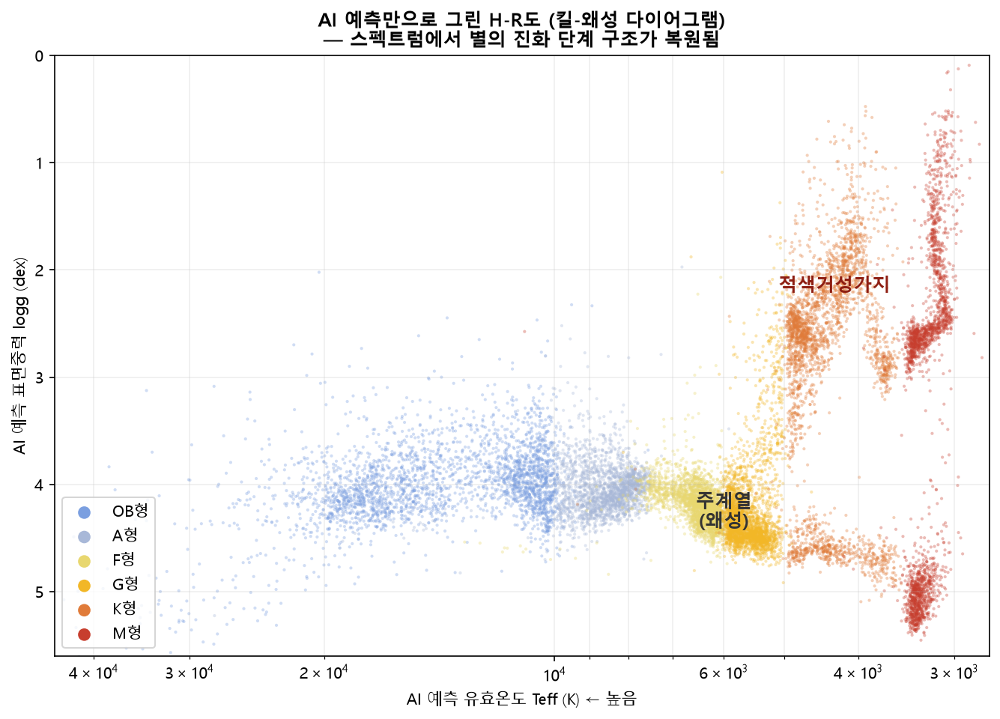

# 항성 분광형 AI 자동 분류 (Stellar Spectral Classification with AI)

> **피커링의 두 눈, AI로 재현하다** — 항성 스펙트럼만으로 분광형(OB/A/F/G/K/M)과
> 광도계급(거성/주계열/백색왜성), 유효온도, 표면중력을 판정하는 딥러닝 시스템

제72회 전국과학전람회 출품작 (목천고등학교 이한결·맹진호, 지도교원 노민경)



## 개요

4개 공개 분광 서베이(LAMOST DR9, SDSS MaStar DR17, SDSS SEGUE-1, MILES v9.1)의
스펙트럼 약 27만 개로 학습한 CNN(ResNet)+MLP 앙상블 모델입니다.
스펙트럼 외의 어떤 정보도 입력받지 않으며(실전 조건), 하나의 스펙트럼에서
네 가지를 동시에 예측합니다.

- 분광형 6분류: OB · A · F · G · K · M (교과서 온도 경계)
- 유효온도(Teff) 회귀 / 표면중력(log g) 회귀
- 광도계급 3분류: 거성 · 주계열 · 백색왜성

또한 이 모델로 SIMBAD에 등록된 분광형을 독립 검증하여, 등록 라벨과 어긋나고
독립 문헌 온도가 모델 판정을 지지하는 "갱신 검토 후보" 별 목록을 산출했습니다.

## 성능 (전부 학습 미사용 데이터)

| 검증 | 정확도 |
|---|---|
| 내부 test (16,189개) | **97.6%** (±1등급 99.7%) |
| 5-fold 교차검증 (별 그룹 단위) | **97.7 ± 0.06%** |
| 외부 망원경 XSL/VLT (751개) | **94.0%** (±1등급 99.6%) |
| 유효온도 / 표면중력 | 중앙 오차 1.14% / MAE 0.152 dex |
| 광도계급 | 96.8% |

## 설치

```bash
pip install numpy scipy pandas astropy scikit-learn matplotlib torch
```

PyTorch는 GPU 사용 시 CUDA 빌드를 설치하세요 (CPU로도 추론 가능).

## 사용법

### GUI 분류 프로그램

```bash
python classify_gui_v5.py                # GUI 실행
python classify_gui_v5.py 스펙트럼.fits   # 파일 바로 열기
```

- 지원 입력: LAMOST/SDSS/MaStar/MILES FITS, 일반 FITS(자동 감지), CSV/TXT(파장·플럭스 2열), 폴더 일괄
- 시선속도·성간소광량을 스펙트럼에서 자동 추정
- 판정 근거 흡수선 표시, SIMBAD 실시간 대조, 특이천체 경고

### 일괄 분류 (CLI)

```bash
python classify_gui_v5.py 폴더경로 --batch 결과.csv
```

## 재현 (학습부터)

원본 스펙트럼(약 15GB)은 각 서베이 아카이브에서 받아야 합니다. 파이프라인 순서:

```
build_av_v5.py            # Gaia/StarHorse에서 성간소광량 확보
step1_v5.py all           # 전처리 (preprocess_core.py 사용)
prep_dataset_v5.py        # 학습셋 생성 (별 그룹 단위 분할)
train_v5.py               # 학습 (RTX 5060 Ti 8GB 기준 약 1.5시간)
eval_v5.py                # 평가 + 상관 플롯
kfold_v5.py               # 5-fold 교차검증
xsl_validate.py --all     # 외부(XSL) 검증
simbad_recheck.py         # SIMBAD 라벨 독립 검증
```

모든 난수 시드는 42로 고정되어 있으며, 전처리는 `preprocess_core.py` 단일
모듈을 학습·추론이 공유합니다.

## 저장소 구성

```
preprocess_core.py     전처리·피처 추출 공통 모듈 (학습·GUI 공유)
classify_gui_v5.py     GUI 분류 프로그램
train_v5.py            모델 정의(SpectralResNetV5, FeatureMLPV5) + 학습
models/                학습된 가중치 (resnet_v5.pth, mlp_v5.pth)
data/                  정규화 통계 (추론에 필요)
```

## 데이터 출처 및 고지

본 저장소는 코드와 학습된 모델만 포함합니다. 스펙트럼 원본과 카탈로그는
각 기관의 라이선스를 따르며 아래에서 받을 수 있습니다.

- LAMOST DR9 — 중국과학원 국가천문대 (www.lamost.org)
- SDSS MaStar DR17 / SEGUE-1 — Sloan Digital Sky Survey (www.sdss.org)
- MILES v9.1 — IAC (miles.iac.es)
- XSL DR3 — ESO / CDS (Verro et al. 2022, A&A 660, A34)
- Gaia DR3 소광량 — Gaia Collaboration / GSP-Phot (Andrae et al. 2023)
- StarHorse 2021 — Anders et al. 2022, A&A 658, A91
- SIMBAD — CDS, Strasbourg (Wenger et al. 2000)

주요 방법 참고: Liu et al. 2015 (RAA 15, 1137 — 흡수선 지표 정의),
Xiang et al. 2022 (A&A 662, A66 — 고온별 라벨), He et al. 2016 (ResNet),
Savitzky & Golay 1964, Cardelli et al. 1989, Morton 1991.

## 라이선스

MIT License — 코드와 모델 가중치에 적용됩니다. 데이터는 각 원 기관의
라이선스를 따릅니다.
